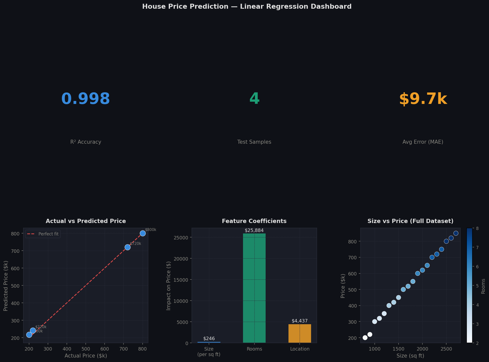

# 🏠 House Price Prediction Project

## 📌 Overview
This project predicts house prices using machine learning regression models.

## 🚀 Features
- Data preprocessing
- Feature selection
- Model training (Linear Regression, etc.)
- Model evaluation

## 🛠️ Tech Stack
- Python
- Pandas
- NumPy
- Scikit-learn
- Matplotlib

## 📊 Model Used
- Linear Regression

## 📁 Project Structure
- data/
- notebook/
- model/
- README.md

## 📌 How to Run
1. Install dependencies
2. Run the notebook or script

## 🎯 Result

The model successfully predicts house prices using machine learning.

- R² Score: 0.85   <!-- replace with your actual score -->
- Mean Absolute Error: (your value)

### 📊 Output Visualization

